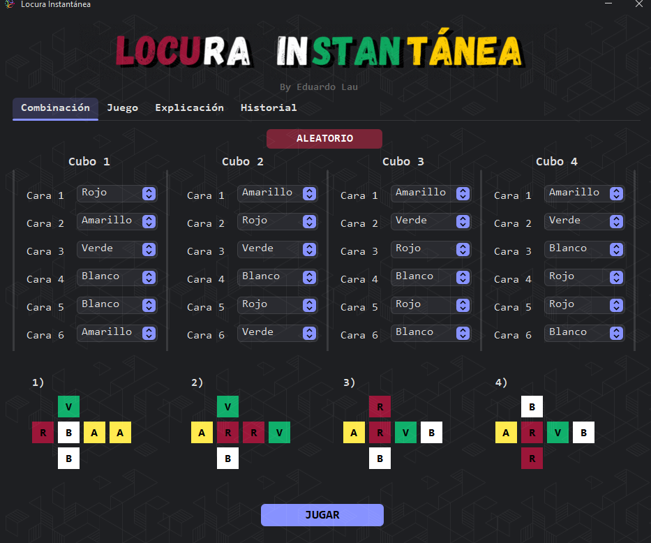
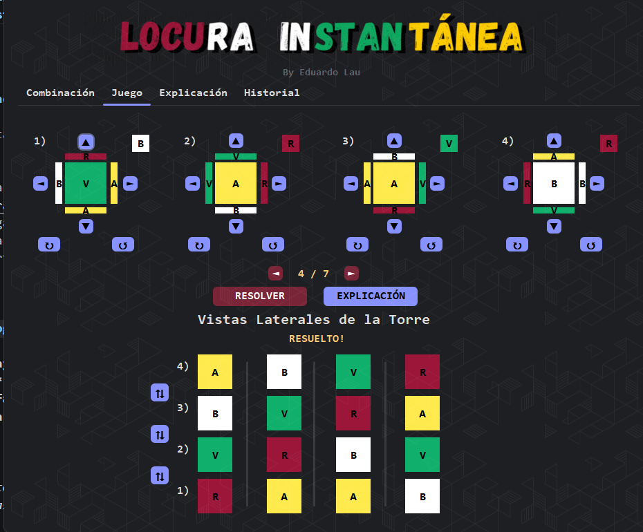
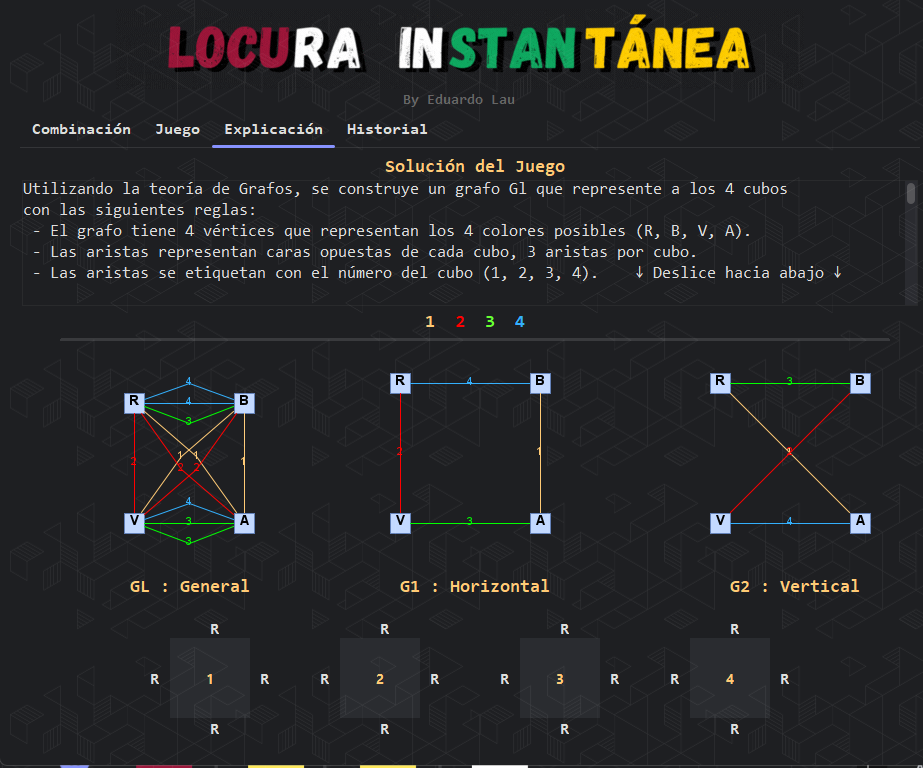
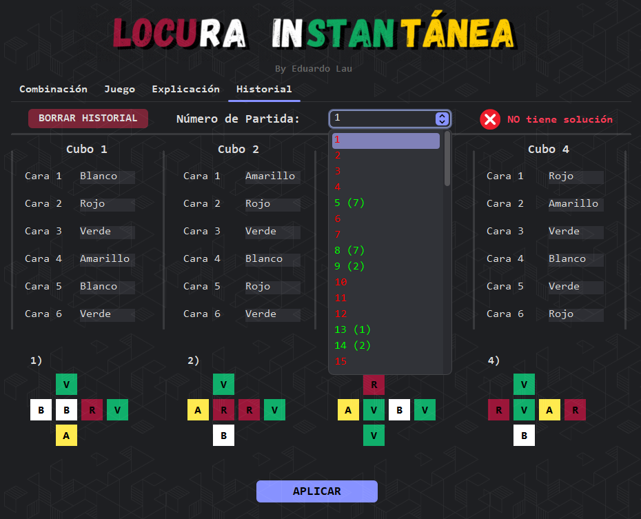

# 🧩 Locura Instantánea (Instant Insanity)

**Locura Instantánea** es una implementación digital del clásico rompecabezas lógico que desafía la mente. El objetivo parece simple, pero la complejidad matemática es asombrosa: debes apilar cuatro cubos de colores de tal manera que en cada una de las cuatro caras de la torre resultante no se repita ningún color.

---

## Características Principales

El software se divide en cuatro módulos clave diseñados para llevarte desde la configuración hasta la comprensión total del puzzle:

### 1. Configuración de Combinación
Personaliza el reto. En esta pestaña puedes asignar los colores (**Rojo, Blanco, Verde, Amarillo**) a cada una de las caras de los cuatro cubos. Esto permite probar tanto el rompecabezas original como configuraciones personalizadas.

  

### 2. Modo Juego
¡Aquí ocurre la acción! Interactúa con los cubos, rótalos en diferentes ejes y observa cómo se construye la torre en tiempo real. La interfaz te permite visualizar las cuatro caras de la torre simultáneamente para verificar si has resuelto el desafío.

  

### 3. Explicación (Resolución por Grafos)
Para el entusiasta de la ingeniería, esta pestaña desglosa la solución matemática. Utiliza **Teoría de Grafos** para representar las caras opuestas de los cubos y encontrar los dos subgrafos necesarios para resolver el problema de forma infalible.

  

### 4. Historial de Partidas
Lleva un registro de tus intentos. Aquí puedes consultar las partidas jugadas anteriormente, revisando qué combinaciones de colores utilizaste y los resultados obtenidos.

  

## Instalación y Uso

No necesitas configurar un entorno de desarrollo para probar el juego. Sigue estos pasos:

1. Ve a la sección de **[Releases](https://github.com/Eduardo-Lau/MC2N_Locura_Instantanea/releases)** de este repositorio.
2. Descarga la versión más reciente del instalador (`.exe` o `.zip`).
3. Ejecuta el instalador y sigue las instrucciones.
4. ¡Diviértete resolviendo la Locura!

---

## Tecnologías Utilizadas

* **Lenguaje:** Java
* **IDE:** NetBeans
* **Interfaz:** Swing / AWT
* **Lógica:** Teoría de Grafos aplicada

---

> *Proyecto desarrollado con fines académicos para el estudio de algoritmos y estructuras de datos.*